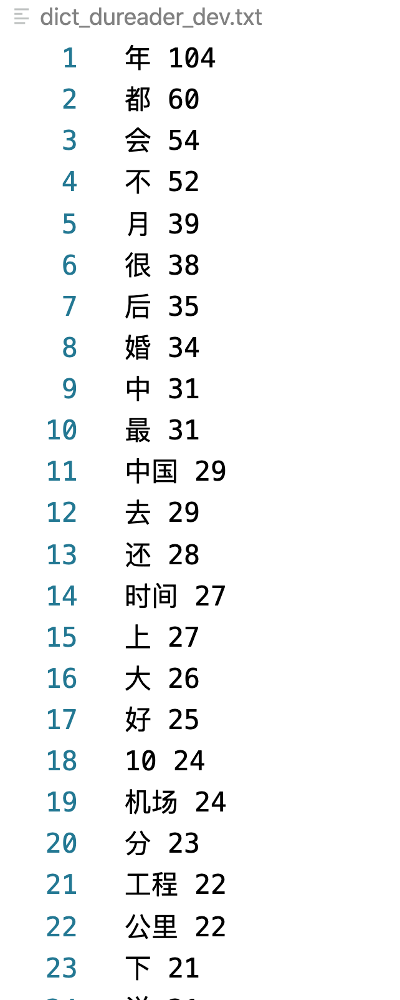
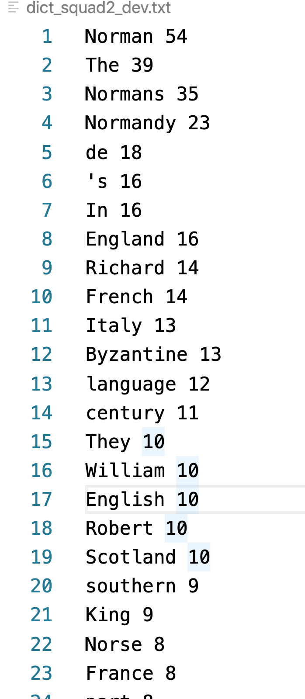
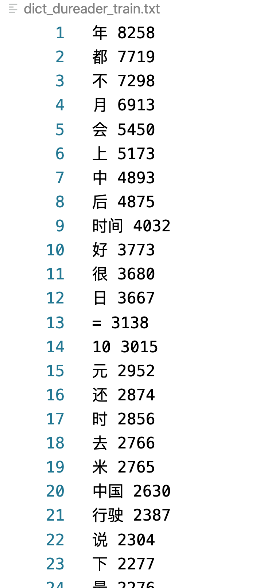
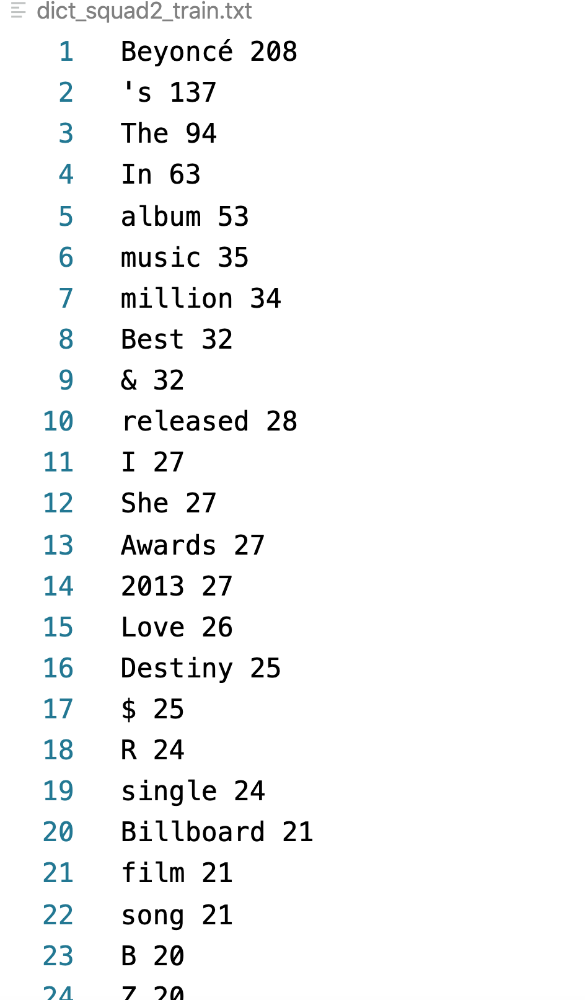

### 机器阅读理解及人物解析作业
#### 1 作业要求：
##### homework_01说明：
- 1、获取Dureader robust和SQuAD2.0数据集（不需提交）
- 2、对于Dureader robust和SQuAD2.0数据集，整理词典（词频从高到低）（需要提交处理代码及词典）
   1） 数据处理、解析，提取语料信息。(程序逻辑正确20，代码简洁无bug30)
   2）使用分词工具处理语料。(工具使用正确20)3）对词频进行统计排序，输出到文本文件。(程序逻辑正确20，代码简洁无bug30)
   4）整体程序运行无bug(20)
   词典格式：
   aa 1000
   bb 999
#### 2 作业代码说明：
* 作业代码分为二个文件，“preprocess_training_data.py”和“stopwords.txt”。
* 其中，“preprocess_dev_data.py”是调用小样本数据的代码文件，
* “preprocess_training_data.py”是调用全样本训练数据的代码文件，二者的代码结构基本相同，代码都加入了详细的注释内容。

#### 3 辅助文件说明： 
* 辅助文件为"stopwords.txt"。该文件为停用词集合文本文档，该停用词基于百度的停用词表加上了少数的一些其他过高频词。
* 英文文档采用nltk工具包进行分词，中文文档采用jieba（paddle增强）进行分词。

#### 4 词典文件说明： 
* 小型数据的词典文件是"dict_dureader_dev.txt"是根据DuReader小样本数据“demo/demo_train.json”得到的逆序词频列表。
  部分的列表截图如下图所示
  
* 小型数据的词典文件是"dict_squad_dev.txt"是根据SQuAD小样本数据“dev-v2.0.json”上得到的逆序词频列表。
  部分的列表截图如下图所示
  

* 大型数据（训练样本）的结果文件是根据DuReader的训练样本数据"dureader_robust-data/train.json"得到的逆序词频列表是"dict_dureader_train.txt"，部分的列表截图如下图所示：
  
  关于全样本训练集合“dureader_robust-data/train.json”的context个数为14520，采用for循环进行迭代提取分量进行分词耗用大量的时间，在服务器上跑了3个小时得到结果，中文的词典结果如图"DuReader_Result.png"所示，可以看出，中文结果中“年”的频次最高，达到了8258，可以推测中文DuReader中有很多关于年份的时间信息记录，
* 类似的，在较大型SQuAD训练数据“train-v2.0.json”上得到的逆序词频列表为“dict_squad2_train.txt”，，部分的列表截图如下图所示：
  
   英文的词典如图"SQuAD2_RESULT.png"所示，英文结果中“Beyonce”的频次最高，达到了208，推测英文SQuAD2主要是关于乐坛方面的内容，特别是黑人女性歌手方面的信息会比较多一些。